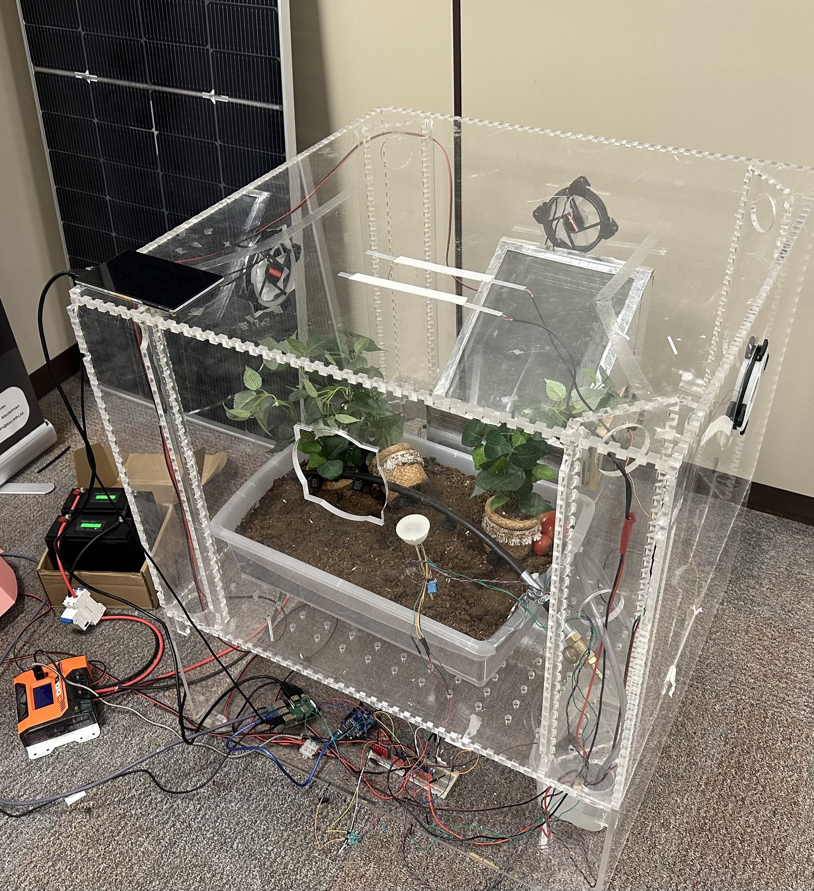
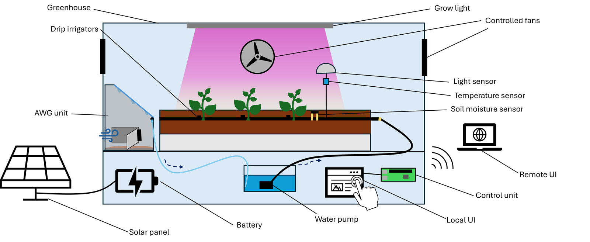
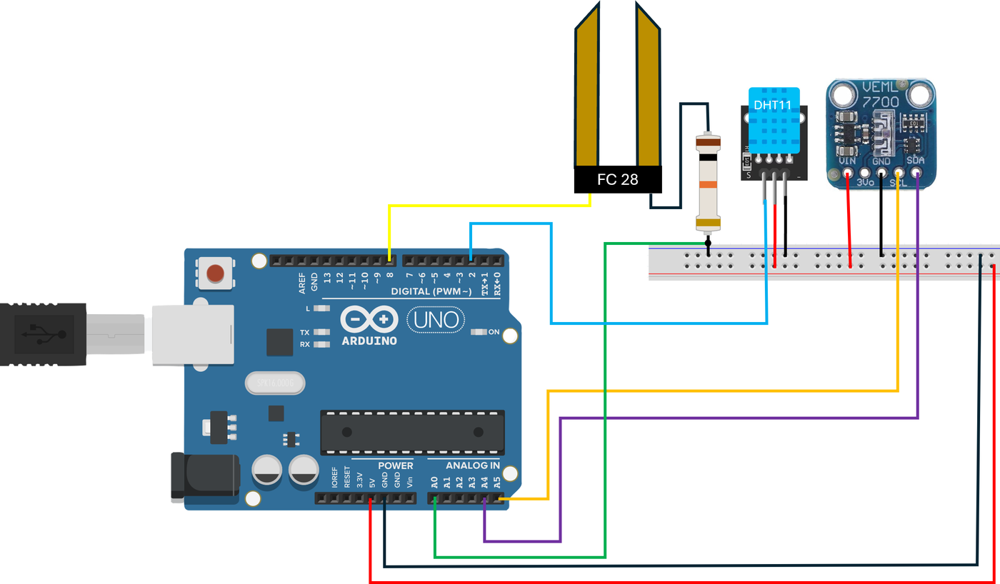
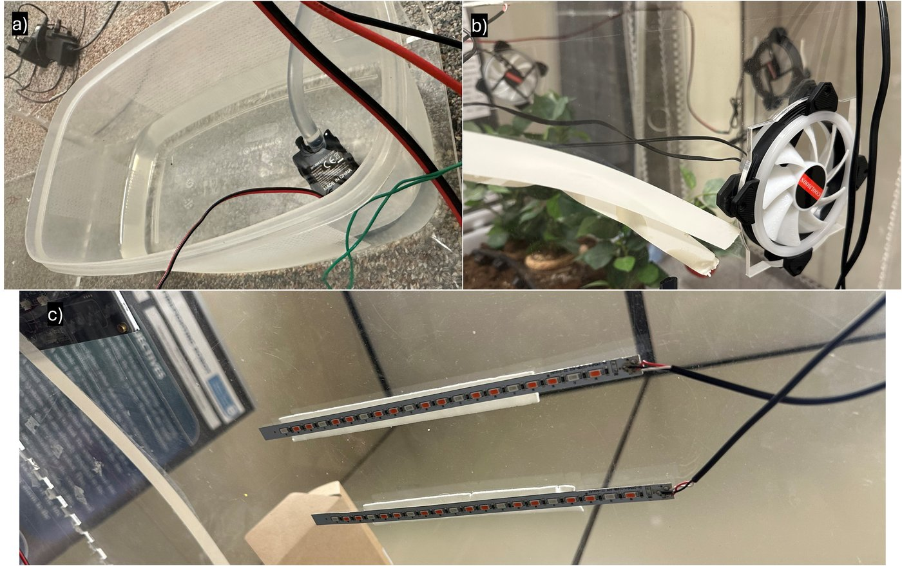
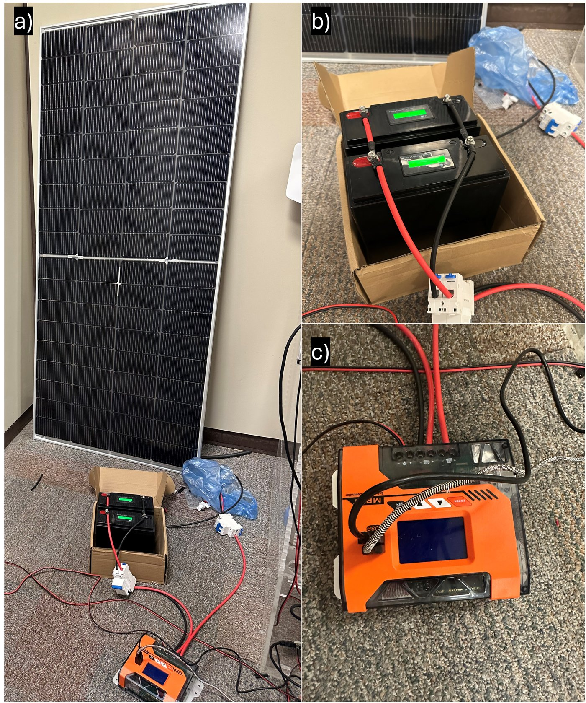
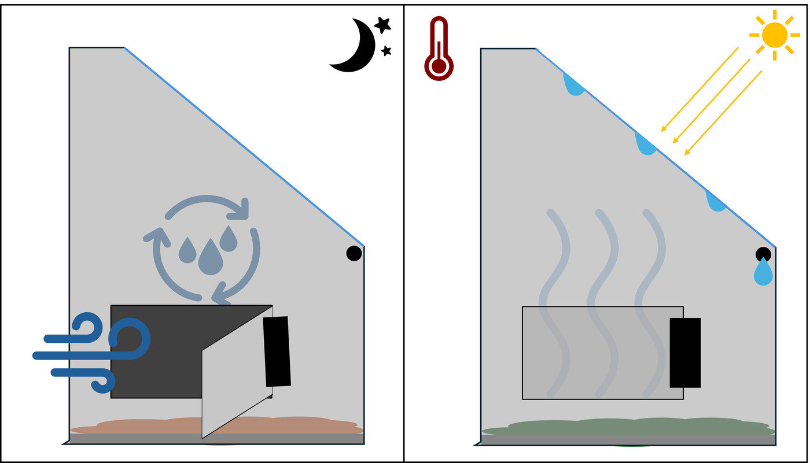
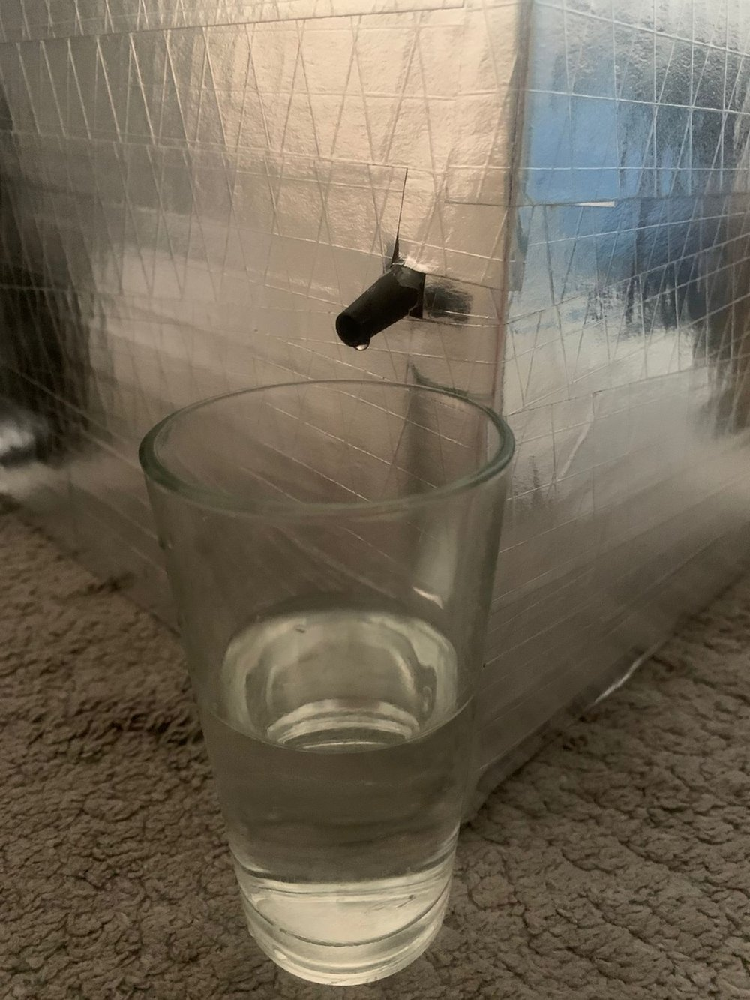
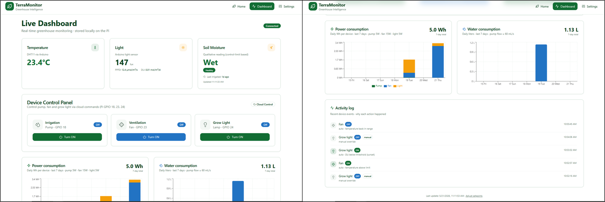
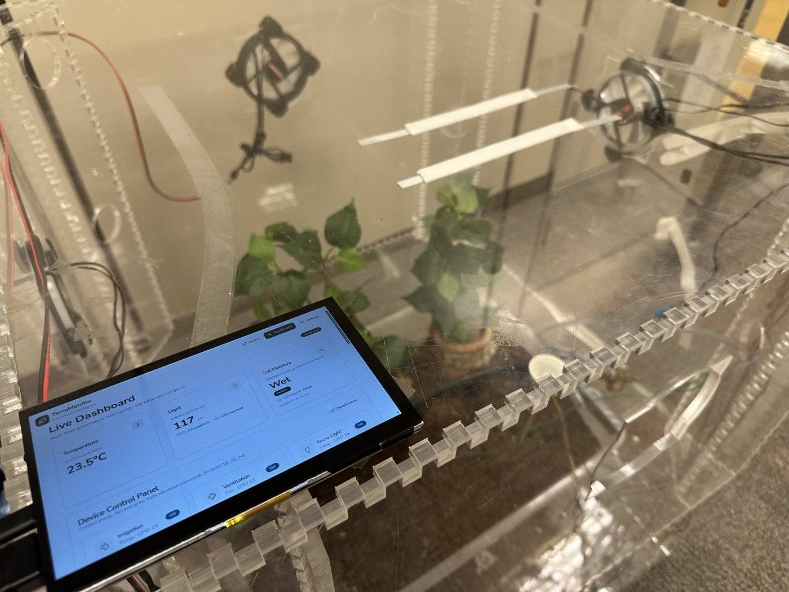
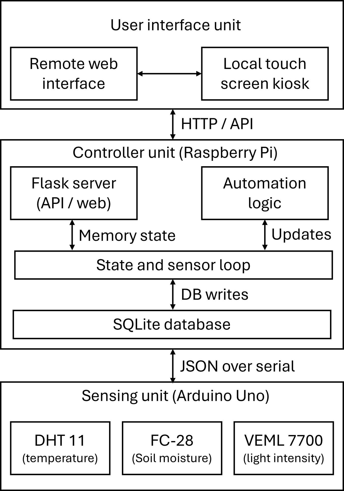

<div align="center">

# 🌱 TerraMonitor

### Solar-Powered Automated Greenhouse

**CEN 492 Graduation Project · King Saud University, Dept. of Computer Engineering**

[](https://react.dev/)
[](https://www.typescriptlang.org/)
[](https://flask.palletsprojects.com/)
[](https://www.raspberrypi.com/)
[](https://www.arduino.cc/)



</div>

A greenhouse that waters, cools, and lights itself. Sensors watch the soil, air, and sun;
a Raspberry Pi decides what to do about it; solar panels keep the lights on; and a
desiccant unit pulls irrigation water straight out of the air. This repo holds the
software — Arduino firmware, Pi controller, and the web dashboard — for the whole build.

<div align="center">

</div>

## The build

**Sensing** — DHT11, an FC-28 soil probe, and a VEML7700 light sensor feed an Arduino Uno,
which streams JSON to the Pi over serial every half second.



**Actuators** — pump, fans, and red/blue grow lights, each on its own MOSFET driver off
the Pi's GPIO.



**Power** — a 280 W solar panel charges a 50 Ah LiFePO4 battery bank through an MPPT
controller, giving the whole system ~1.5 days of off-grid autonomy.



**Water, out of thin air** — a passive atmospheric water generator: silica gel soaks up
humidity overnight, then a sealed glass-topped box uses solar heat to sweat it back out as
water during the day.




**Dashboard** — live readings, manual overrides, consumption charts, and an activity log
that explains *why* something turned on. Also runs as a touchscreen kiosk mounted right on
the greenhouse.




## How it fits together

```
[Arduino Uno]  --USB serial (JSON)-->  [Raspberry Pi]  <--HTTP-->  [React dashboard]
   sensors                                Flask + SQLite              web or kiosk
                                           relays + automation
```



Everything is local-first — the Pi stores every reading and device event in SQLite and
serves it over the LAN, no cloud required. Fan, pump, and grow-light thresholds are all
editable live from the dashboard's Settings page.

## Running it

```bash
# Pi controller
cd raspberry-pi
python3 -m venv venv && source venv/bin/activate
pip install -r requirements.txt
python3 app.py
```

```bash
# Dashboard
npm install
npm run dev   # http://localhost:8080
```

Point the dashboard at the Pi's IP from **Settings → Raspberry Pi connection**. More detail
on GPIO pins, systemd, and troubleshooting in [raspberry-pi/README.md](raspberry-pi/README.md).

<details>
<summary><strong>HTTP API</strong></summary>

| Method | Path                        | Description                        |
| ------ | --------------------------- | ------------------------------------ |
| GET    | `/api/status`                | Health + uptime + device states     |
| GET    | `/api/sensors`                | Latest reading + device states      |
| GET    | `/api/history?hours=24`       | Raw readings for the window         |
| GET    | `/api/consumption?days=7`     | Daily Wh + mL per device            |
| GET    | `/api/events?limit=50`        | Recent device events with reason    |
| GET/POST | `/api/settings`             | Read/update automation thresholds   |
| POST   | `/api/irrigation\|fan\|grow_light\|door/<on\|off>` | Manual device control |

</details>

## Team

**Abdulrahman Bin Zuair** (lead) · Badr Owais · Abdulrahman Albulaihi
Advisor: Dr. Abdulwadood Abdulwaheed — KSU College of Computer and Information Sciences

---

<div align="center">
Built with Vite + React + TypeScript + Tailwind + shadcn/ui.
</div>
